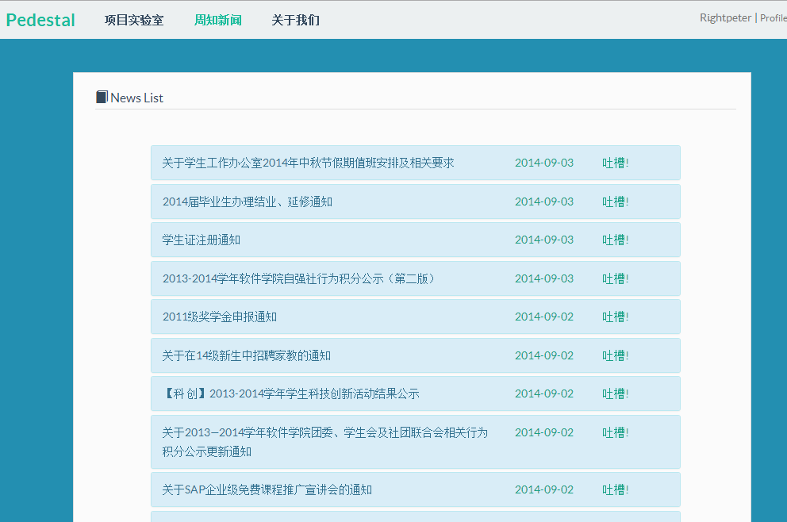
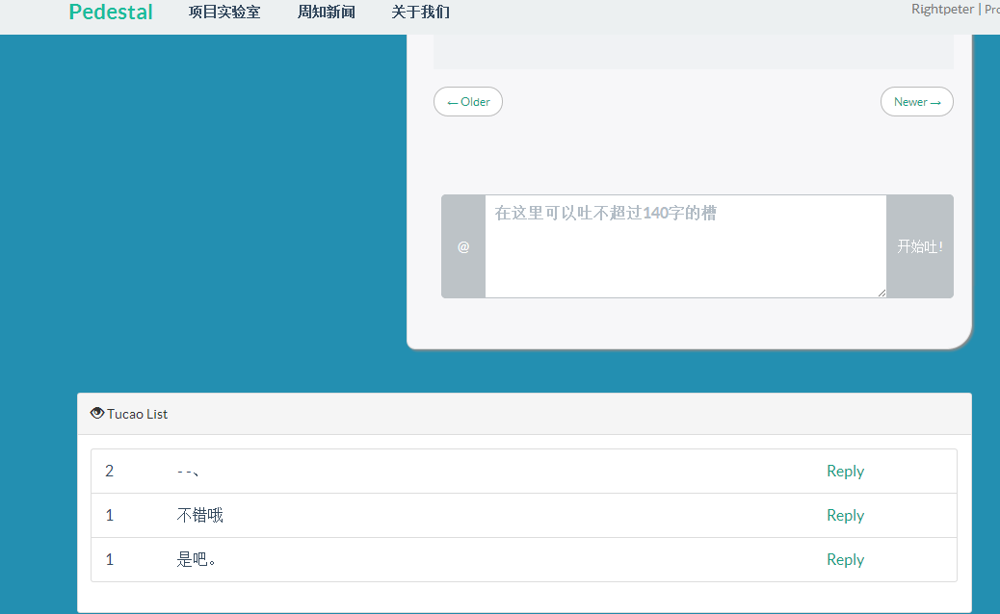

##Pedestal主页
### http://www.pedestal.cn/

##使用

1. 安装依赖：`pip install -r requirements.txt`，如果使用MySQL，要安装驱动，`pip install MySQL-python`
2. 数据库设置，打开`db.py`，例如：
NewsDatabase = tornado.database.Connection(
    "localhost:3306",
    "user",
    "database",
    "passwd",)

3. 建表`python creatDatabaseTable.py`
4. 抓取新闻`python server_update.py`，等待片刻抓取结束。未来这个进程会自动更新新闻，现在只是抓取一次。
5. 跑起tornado server：`python server_comm.py`

